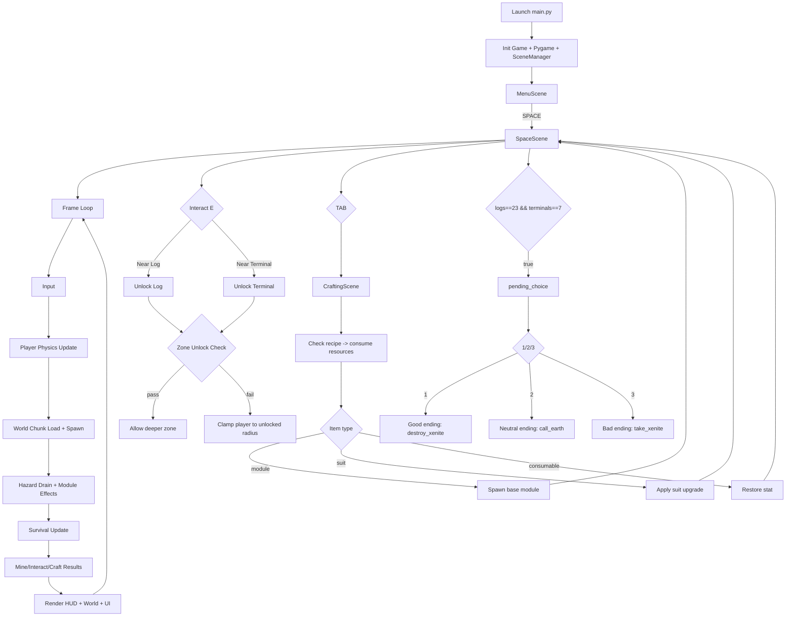
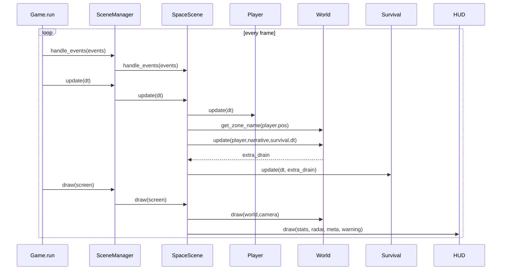
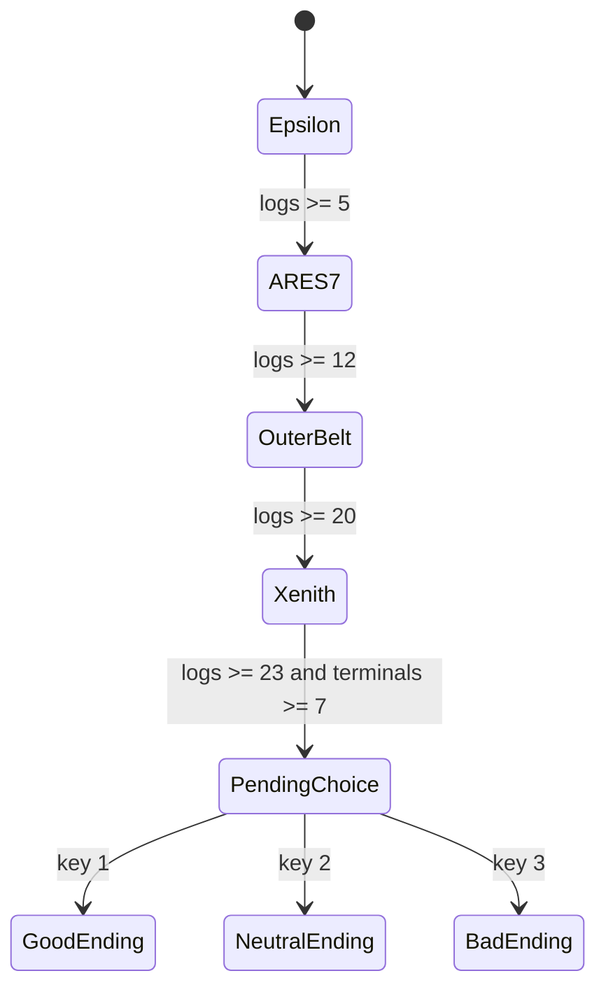

# Void Frontier - Technical Design & Runtime Documentation

## 1. Muc tieu va dinh huong gameplay

Void Frontier la game survival-kham pha khong gian 2D su dung pygame. Gameplay duoc thiet ke theo vong lap:

`Explore -> Mine -> Survive -> Decode -> Expand`

Player bat dau tu escape pod, bay trong moi truong zero-g de thu thap tai nguyen, duy tri cac chi so song con, mo khoa logs/terminals ve bi an Xenite, craft module/suit va tien toi endgame zone.

## 2. Tong quan cau truc project

```
void-frontier/
|- main.py
|- settings.py
|- data_loader.py
|- asset_loader.py
|- scenes/
|  |- scene_manager.py
|  |- scene_base.py
|  |- menu_scene.py
|  |- space_scene.py
|  |- crafting_scene.py
|  |- station_scene.py
|- systems/
|  |- world.py
|  |- survival.py
|  |- inventory.py
|  |- crafting.py
|  |- narrative.py
|  |- physics.py
|- entities/
|  |- player.py
|  |- asteroid.py
|  |- hazard.py
|  |- module.py
|  |- particle.py
|- ui/
|  |- hud.py
|  |- inventory_ui.py
|  |- dialogue_ui.py
|- data/
|  |- asteroids.json
|  |- recipes.json
|  |- logs/log_01.json ... log_23.json
|- assets/
|  |- images/... (placeholder Add.md)
|  |- sounds/... (placeholder Add.md)
|- docs/
   |- 01.md
```

## 3. Runtime architecture

### 3.1 Main game loop

`main.py` khoi tao `Game`, tao window va chay vong lap:

1. Tinh `dt` theo FPS.
2. Poll events tu pygame.
3. Forward event cho scene hien tai qua `SceneManager`.
4. Update scene hien tai.
5. Draw scene hien tai.

### 3.2 Scene stack model

`SceneManager` quan ly stack scenes:

- `set(scene)`: thay toan bo stack bang scene moi.
- `push(scene)`: mo overlay scene (vi du Crafting UI).
- `pop()`: dong overlay, quay ve scene truoc.

Cach dung hien tai:

- `MenuScene` -> `SpaceScene` (SPACE).
- Tu `SpaceScene` co the `push(CraftingScene)` (TAB).

## 4. Core gameplay loop theo code hien tai

### 4.1 Explore

- Player di chuyen bang jetpack (`WASD`) trong zero-g.
- Physics co quan tinh, drag nhe va co phanh chu dong (`SHIFT`/`SPACE`).
- Camera follow player theo world-space.

### 4.2 Mine

- Click chuot trai de mine asteroid.
- Check va cham chuot vao asteroid + check khoang cach drill (`MINE_RANGE`).
- Damage asteroid theo `MINING_POWER + mining_power_bonus`.
- Asteroid bi pha huy se drop resources vao inventory.

### 4.3 Survive

He 5 chi so:

- oxygen
- temperature
- battery
- hunger
- pressure

Moi frame:

`stat -= (base_drain + extra_hazard_drain) * dt`

Them luat phat:

- `pressure <= 0` -> oxygen leak nhanh hon.
- `hunger <= 0` -> temperature giam nhanh hon.

Die condition:

- oxygen <= 0 hoac temperature <= 0 hoac pressure <= 0.

### 4.4 Decode (narrative)

- Interaction key `E` dung de:
  - nhat log node
  - mo terminal node
- Narrative tracking:
  - 23 logs
  - 7 terminals
- Dat du dieu kien se vao `pending_choice` (endgame choice).

### 4.5 Expand

- Craft recipes trong `CraftingScene`.
- 3 nhom crafting:
  - Module: habitat, lab, greenhouse, hangar, signal_tower
  - Suit upgrades: explorer/engineer/combat
  - Consumable: battery_pack, ration_pack

Tac dung progression:

- Module sinh hieu ung support khi o gan.
- Suit upgrade thay doi stats gameplay.
- Logs mo khoa zone tiep theo.

## 5. Chi tiet he thong

### 5.1 Player (entities/player.py)

State va thong so:

- `pos`, `vel`, `acc`
- `accel`, `brake_accel`, `max_speed`, `drag`
- progression stats: `mining_power_bonus`, `hazard_resistance`

Input logic:

- `WASD`: thrust vector
- `SHIFT` hoac `SPACE`: active brake, triet tieu van toc

Update logic:

1. Handle input
2. `vel += acc * dt`
3. `vel *= drag`
4. Clamp max speed
5. `pos += vel * dt`
6. Update animation theo state

### 5.2 Survival (systems/survival.py)

Data model:

- `stats: Dict[str, float]`
- `base_drain: Dict[str, float]`

API chinh:

- `update(dt, extra_drain)`
- `modify/stat restore/drain/damage`
- `is_dead()`

### 5.3 World (systems/world.py)

#### Chunk streaming

- World chia thanh chunk (`CHUNK_SIZE`).
- Moi frame load 3x3 chunks quanh player.
- Chunk da load duoc luu trong `loaded_chunks`.

#### Zone progression

Zones:

- epsilon
- ares-7
- outer-belt
- xenith

Unlock rules (`ZONE_UNLOCK_REQUIREMENTS`):

- epsilon: 0 logs
- ares-7: 5 logs
- outer-belt: 12 logs
- xenith: 20 logs

Gate movement:

- `SpaceScene.update()` gioi han ban kinh di chuyen theo zone da unlock.

#### Content spawn theo zone

Moi zone co:

- Bang asteroid rieng (`ZONE_ASTEROID_TABLE`)
- Ti le hazard rieng (`ZONE_HAZARD_CHANCE`)
- He so HP asteroid rieng (`ZONE_HP_SCALE`)

#### Hazard system

- `RadiationZone`: drain pressure + temperature
- `EMPStorm`: drain battery
- `DebrisField`: damage pressure truc tiep + slow velocity

#### Narrative nodes

- Random spawn log nodes va terminal nodes khi load chunk.
- Interaction `E` o gan se unlock narrative progress.

#### Base modules

`world.modules` gom cac module da build:

- Habitat: hoi oxygen + temperature
- Greenhouse: hoi hunger
- Hangar: hoi pressure
- Lab, SignalTower: hien tai dung cho progression/trang tri logic

### 5.4 Inventory va Crafting

Inventory (`systems/inventory.py`):

- map `item -> amount`
- add / has / remove / get_all

Crafting (`systems/crafting.py`):

- doc recipe tu `data/recipes.json`
- `can_craft` check du resource
- `craft` tru resource
- `classify` item thanh module/suit/consumable

### 5.5 Narrative system (systems/narrative.py)

Tracking:

- `unlocked_logs: set`
- `terminals: set`
- `final_choice`

Ending states:

- `good` = destroy_xenite
- `neutral` = call_earth
- `bad` = take_xenite
- `pending_choice` = da du logs + terminals
- `incomplete` = chua du dieu kien

### 5.6 UI systems

HUD (`ui/hud.py`) hien thi:

- 5 stat bars
- radar asteroid mini-map
- zone + logs + terminals + modules
- warning low stat
- controls hint

InventoryUI (`ui/inventory_ui.py`):

- toggle `I`
- overlay list item + amount

DialogueUI (`ui/dialogue_ui.py`):

- da co implementation typewriter text
- chua duoc hook vao SpaceScene hien tai

## 6. Data schema

### 6.1 Asteroids (`data/asteroids.json`)

Mau schema:

```json
{
  "asteroid_type": {
    "hp": 58,
    "drops": {
      "resource_name": [min, max]
    }
  }
}
```

Types hien co:

- iron
- titanium
- silicon
- copper
- ice (drop h2o)
- carbon (drop co2, organic)

### 6.2 Recipes (`data/recipes.json`)

Mau schema:

```json
{
  "item_name": {
    "cost": {
      "resource": amount
    }
  }
}
```

Nhom recipes:

- Base modules
- Suit upgrades
- Consumables

### 6.3 Logs (`data/logs/log_01..23.json`)

Mau schema:

```json
{
  "id": 1,
  "title": "Arrival",
  "text": "...",
  "audio": "log01.ogg"
}
```

## 7. Input map

- `SPACE` (Menu): Start game
- `W A S D`: Move / thrust
- `SHIFT` hoac `SPACE` (in-game): Brake
- `LMB`: Mine asteroid
- `E`: Interact log/terminal
- `TAB`: Open crafting scene
- `I`: Toggle inventory overlay
- `UP/DOWN` (crafting/inventory): Navigate
- `ENTER` (crafting): Craft selected item
- `ESC` (crafting/station): Close overlay scene
- `1/2/3` (pending_choice): Chon ending

## 8. MermaidJS - Tong luong hoat dong game



## 9. MermaidJS - Luong frame chi tiet (sequence)



## 10. MermaidJS - State machine progression



## 11. Ghi chu implementation quan trong

1. `systems/physics.py` hien dang khong duoc goi trong SpaceScene (player tu xu ly physics trong `entities/player.py`).
2. `DialogueUI` da co san nhung chua duoc tich hop vao flow narrative.
3. Folder assets hien nhieu `Add.md` placeholder, game van chay nho `asset_loader` co fallback placeholder texture.
4. `data/settings.py` la file settings cu, hien source dang dung `settings.py` o root project.

## 12. De xuat mo rong tiep theo

1. Them objective system theo phase (tutorial -> midgame -> endgame) de guide player ro hon.
2. Hook `DialogueUI` vao event collect log/terminal de tang chat story delivery.
3. Them balancing table cho survival/hazard theo zone de tuning de dang hon.
4. Them save/load progression (inventory, logs, terminals, modules, upgrades).
