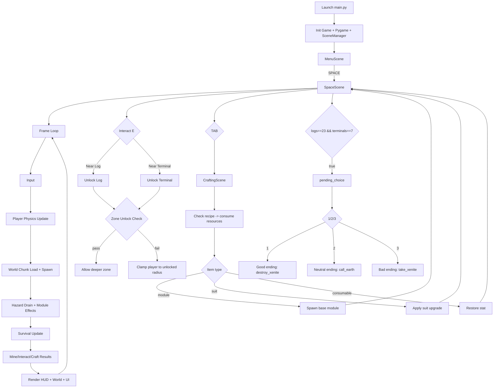
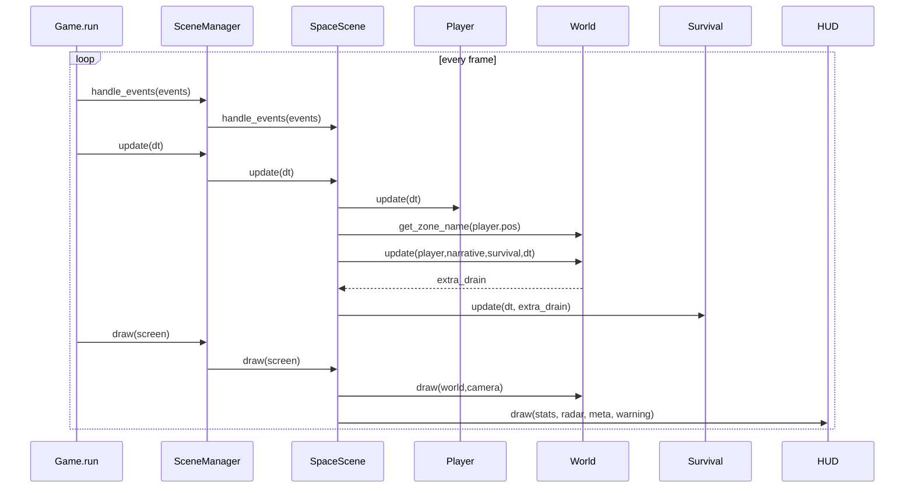
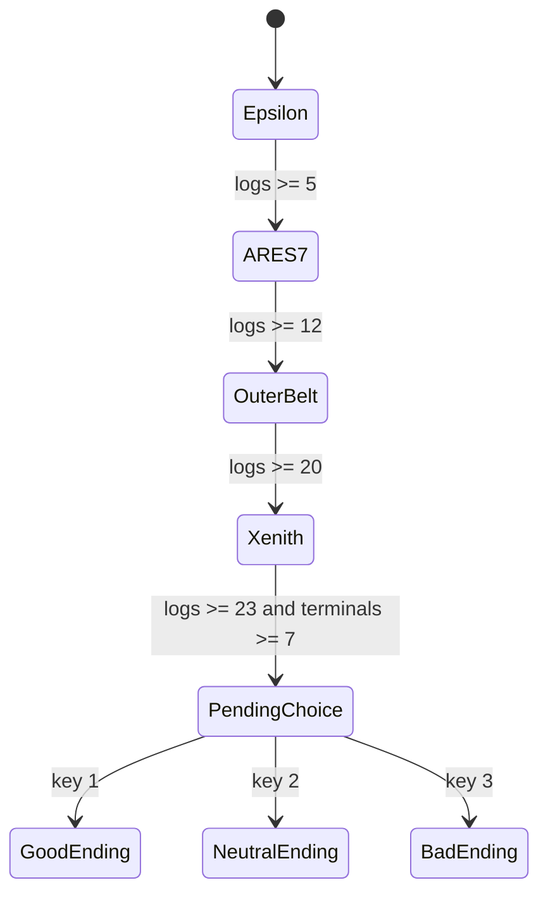

# Void Frontier - Technical Design and Runtime Documentation

## 1. Gameplay Goal and Direction

Void Frontier is a 2D space survival-exploration game built with pygame. The gameplay is designed around the loop:

`Explore -> Mine -> Survive -> Decode -> Expand`

The player starts from an escape pod, flies in a zero-gravity environment to gather resources, maintains survival stats, unlocks logs and terminals about the Xenite mystery, crafts modules and suit upgrades, and progresses toward the endgame zone.

## 2. Project Structure Overview

```
void-frontier/
|- main.py
|- settings.py
|- data_loader.py
|- asset_loader.py
|- scenes/
|  |- scene_manager.py
|  |- scene_base.py
|  |- menu_scene.py
|  |- space_scene.py
|  |- crafting_scene.py
|  |- station_scene.py
|- systems/
|  |- world.py
|  |- survival.py
|  |- inventory.py
|  |- crafting.py
|  |- narrative.py
|  |- physics.py
|- entities/
|  |- player.py
|  |- asteroid.py
|  |- hazard.py
|  |- module.py
|  |- particle.py
|- ui/
|  |- hud.py
|  |- inventory_ui.py
|  |- dialogue_ui.py
|- data/
|  |- asteroids.json
|  |- recipes.json
|  |- logs/log_01.json ... log_23.json
|- assets/
|  |- images/... (placeholder Add.md)
|  |- sounds/... (placeholder Add.md)
|- docs/
   |- 01.md
```

## 3. Runtime Architecture

### 3.1 Main Game Loop

`main.py` initializes `Game`, creates the window, and runs this loop:

1. Compute `dt` from FPS.
2. Poll events from pygame.
3. Forward events to the current scene through `SceneManager`.
4. Update the current scene.
5. Draw the current scene.

### 3.2 Scene Stack Model

`SceneManager` controls a scene stack:

- `set(scene)`: replace the entire stack with a new scene.
- `push(scene)`: open an overlay scene (for example, Crafting UI).
- `pop()`: close the overlay and return to the previous scene.

Current usage:

- `MenuScene` -> `SpaceScene` (SPACE).
- From `SpaceScene`, `push(CraftingScene)` is available (TAB).

## 4. Core Gameplay Loop in Current Code

### 4.1 Explore

- The player moves with a jetpack (`WASD`) in zero gravity.
- Physics includes inertia, light drag, and active braking (`SHIFT`/`SPACE`).
- The camera follows the player in world space.

### 4.2 Mine

- Left mouse click mines asteroids.
- It checks mouse collision with asteroid and drill range (`MINE_RANGE`).
- Asteroid damage is `MINING_POWER + mining_power_bonus`.
- Destroyed asteroids drop resources into inventory.

### 4.3 Survive

The 5 stat system:

- oxygen
- temperature
- battery
- hunger
- pressure

Per frame:

`stat -= (base_drain + extra_hazard_drain) * dt`

Additional penalties:

- `pressure <= 0` -> faster oxygen leak.
- `hunger <= 0` -> faster temperature loss.

Death condition:

- oxygen <= 0 or temperature <= 0 or pressure <= 0.

### 4.4 Decode (Narrative)

- `E` interaction is used to:
  - collect log nodes
  - unlock terminal nodes
- Narrative tracking:
  - 23 logs
  - 7 terminals
- Once conditions are met, the state becomes `pending_choice` (endgame choice).

### 4.5 Expand

- Craft recipes in `CraftingScene`.
- 3 crafting groups:
  - Modules: habitat, lab, greenhouse, hangar, signal_tower
  - Suit upgrades: explorer/engineer/combat
  - Consumables: battery_pack, ration_pack

Progression impact:

- Modules provide support effects in nearby range.
- Suit upgrades change gameplay stats.
- Logs unlock deeper zones.

## 5. System Details

### 5.1 Player (entities/player.py)

State and parameters:

- `pos`, `vel`, `acc`
- `accel`, `brake_accel`, `max_speed`, `drag`
- progression stats: `mining_power_bonus`, `hazard_resistance`

Input logic:

- `WASD`: thrust vector
- `SHIFT` or `SPACE`: active brake, cancel movement speed

Update logic:

1. Handle input
2. `vel += acc * dt`
3. `vel *= drag`
4. Clamp max speed
5. `pos += vel * dt`
6. Update animation by state

### 5.2 Survival (systems/survival.py)

Data model:

- `stats: Dict[str, float]`
- `base_drain: Dict[str, float]`

Main API:

- `update(dt, extra_drain)`
- `modify/stat restore/drain/damage`
- `is_dead()`

### 5.3 World (systems/world.py)

#### Chunk streaming

- The world is divided into chunks (`CHUNK_SIZE`).
- Each frame loads a 3x3 chunk area around the player.
- Loaded chunks are cached in `loaded_chunks`.

#### Zone progression

Zones:

- epsilon
- ares-7
- outer-belt
- xenith

Unlock rules (`ZONE_UNLOCK_REQUIREMENTS`):

- epsilon: 0 logs
- ares-7: 5 logs
- outer-belt: 12 logs
- xenith: 20 logs

Movement gate:

- `SpaceScene.update()` clamps player movement to the unlocked zone radius.

#### Zone-based content spawning

Each zone has:

- Its own asteroid table (`ZONE_ASTEROID_TABLE`)
- Its own hazard probabilities (`ZONE_HAZARD_CHANCE`)
- Its own asteroid HP scale (`ZONE_HP_SCALE`)

#### Hazard system

- `RadiationZone`: drains pressure and temperature
- `EMPStorm`: drains battery
- `DebrisField`: direct pressure damage and velocity slowdown

#### Narrative nodes

- Log and terminal nodes spawn randomly during chunk loading.
- `E` interaction at close range unlocks narrative progression.

#### Base modules

`world.modules` stores crafted modules:

- Habitat: restores oxygen and temperature
- Greenhouse: restores hunger
- Hangar: restores pressure
- Lab and SignalTower: currently used as progression/structure logic

### 5.4 Inventory and Crafting

Inventory (`systems/inventory.py`):

- map `item -> amount`
- add / has / remove / get_all

Crafting (`systems/crafting.py`):

- reads recipes from `data/recipes.json`
- `can_craft` checks resource requirements
- `craft` consumes resources
- `classify` maps items to module/suit/consumable

### 5.5 Narrative System (systems/narrative.py)

Tracking:

- `unlocked_logs: set`
- `terminals: set`
- `final_choice`

Ending states:

- `good` = destroy_xenite
- `neutral` = call_earth
- `bad` = take_xenite
- `pending_choice` = enough logs and terminals
- `incomplete` = requirements not met

### 5.6 UI Systems

HUD (`ui/hud.py`) displays:

- 5 stat bars
- asteroid radar mini-map
- zone + logs + terminals + modules
- low-stat warning
- controls hint

InventoryUI (`ui/inventory_ui.py`):

- toggle `I`
- overlay item list with amounts

DialogueUI (`ui/dialogue_ui.py`):

- typewriter-style dialogue implementation exists
- not yet integrated into current `SpaceScene` flow

## 6. Data Schema

### 6.1 Asteroids (`data/asteroids.json`)

Schema:

```json
{
  "asteroid_type": {
    "hp": 58,
    "drops": {
      "resource_name": [min, max]
    }
  }
}
```

Current types:

- iron
- titanium
- silicon
- copper
- ice (drops h2o)
- carbon (drops co2, organic)

### 6.2 Recipes (`data/recipes.json`)

Schema:

```json
{
  "item_name": {
    "cost": {
      "resource": amount
    }
  }
}
```

Recipe groups:

- Base modules
- Suit upgrades
- Consumables

### 6.3 Logs (`data/logs/log_01..23.json`)

Schema:

```json
{
  "id": 1,
  "title": "Arrival",
  "text": "...",
  "audio": "log01.ogg"
}
```

## 7. Input Map

- `SPACE` (Menu): Start game
- `W A S D`: Move / thrust
- `SHIFT` or `SPACE` (in-game): Brake
- `LMB`: Mine asteroid
- `E`: Interact with log/terminal
- `TAB`: Open crafting scene
- `I`: Toggle inventory overlay
- `UP/DOWN` (crafting/inventory): Navigate
- `ENTER` (crafting): Craft selected item
- `ESC` (crafting/station): Close overlay scene
- `1/2/3` (`pending_choice`): Select ending

## 8. MermaidJS - Full Gameplay Flow



## 9. MermaidJS - Frame-Level Sequence



## 10. MermaidJS - Progression State Machine



## 11. Important Implementation Notes

1. `systems/physics.py` is currently not called by `SpaceScene` (player physics is handled directly in `entities/player.py`).
2. `DialogueUI` exists but is not integrated into the current narrative flow.
3. The assets folder contains many `Add.md` placeholders; the game still runs because `asset_loader` provides fallback placeholder textures.
4. `data/settings.py` is an older settings file; runtime currently uses root `settings.py`.

## 12. Suggested Next Extensions

1. Add an objective system by phase (tutorial -> midgame -> endgame) for clearer guidance.
2. Hook `DialogueUI` into log/terminal interactions to improve story delivery.
3. Add a zone-based balancing table for easier survival and hazard tuning.
4. Add save/load progression (inventory, logs, terminals, modules, upgrades).
